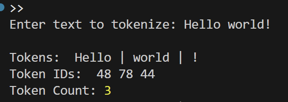
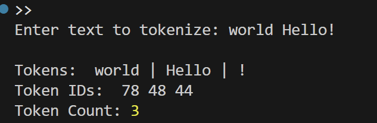
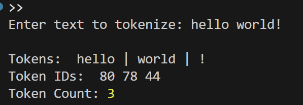
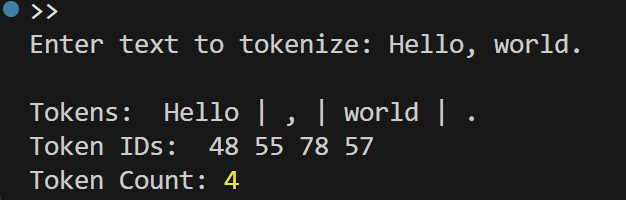
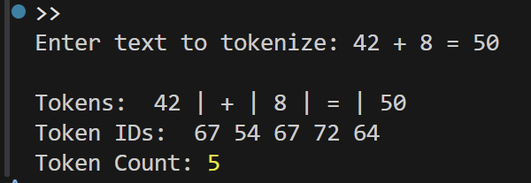
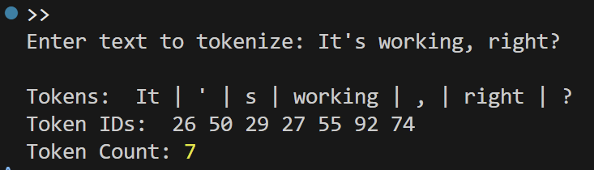

# Tokenizer

A simple Node.js CLI tool that:
1. **Tokenizes** a given text input into words and punctuation.
2. **Generates numeric IDs** for each token using a custom algorithm.
3. **Displays** tokens, their IDs, and the total token count.

## Features

- **Tokenization**: Splits text into words and punctuation using regex.
- **Custom ID Generator**: Assigns each token a unique numeric ID based on character codes.
- **Command Line Interface**: Reads input from the terminal using Node's `readline` module.

## Installation

1. Clone the repository or copy the `index.js` file.
2. Ensure you have [Node.js](https://nodejs.org/) installed (version 14+ recommended).
```bash
node -v
```
3. Save the script as index.js.

## Usage    

Run the script in your terminal:
```bash
node tokenizer.js
```

You’ll be prompted to enter text:
```bash
Enter text to tokenize: Hello world!
```

Example Output:
```bash
Tokens:     Hello | world | !
Token IDs:  78 89 11
Token Count: 3
```

## Examples

### Example 1
**Input:**  
`Hello world!`

**Output:**  


---

### Example 2
**Input:**  
`world Hello!`

**Output:**  


---

### Example 3
**Input:**  
`hello world!`

**Output:**  


---

### Example 4
**Input:**  
`Hello, world.`

**Output:**  


---

### Example 5
**Input:**  
`42 + 8 = 50`

**Output:**  


---

### Example 6
**Input:**  
`It's working, right?`

**Output:**  

